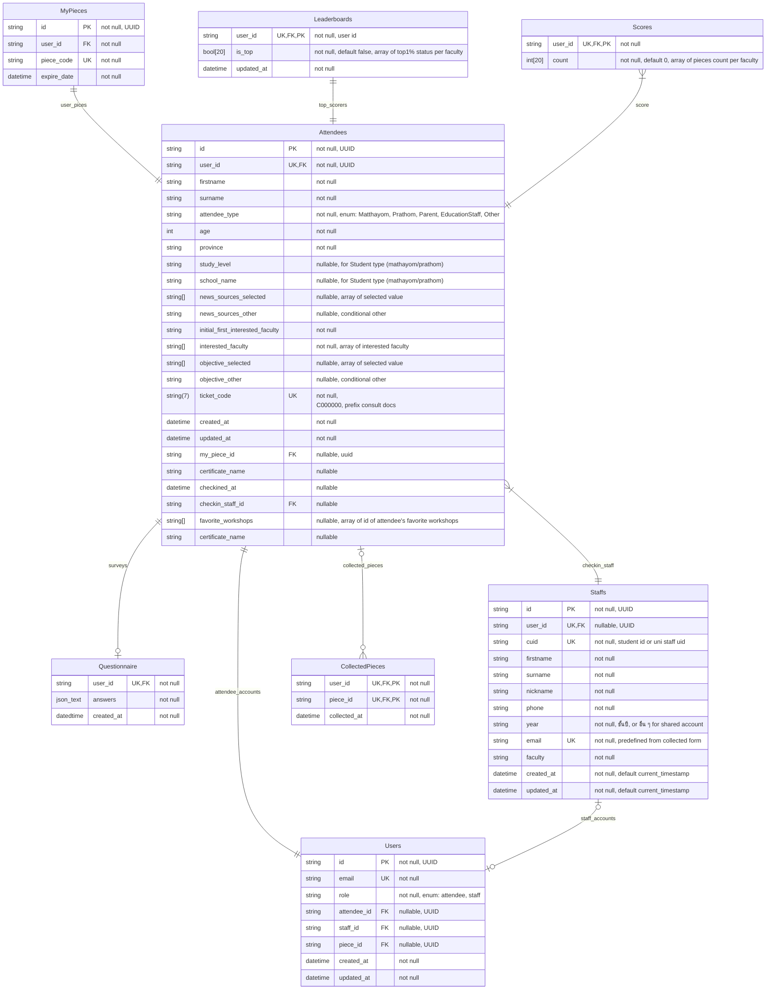

# oph26-backend
ฺBackend repository for Chula Openhouse 2026 website and services.

## Architecture Overview
This backend is built using [Go](https://go.dev/) and [Fiber](https://gofiber.io/) web framework, with [GORM](https://gorm.io/) as the ORM for database interactions. Please refer to the [Golang Clean Architecture](https://github.com/khannedy/golang-clean-architecture) for more details on the architectural patterns used.

## Database ER Diagram

